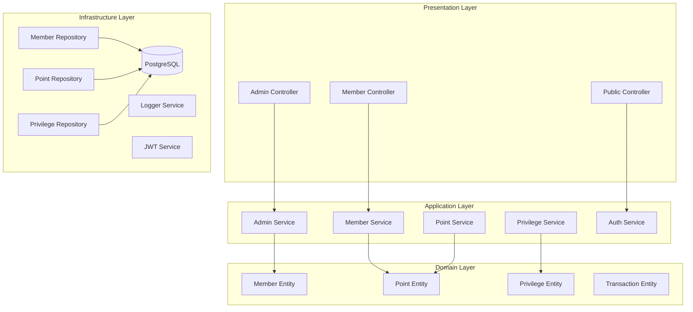

# Design Document

## Overview

The Member Service System is a comprehensive NestJS application that implements a point-based membership system with privilege exchange functionality. The system follows Domain-Driven Design (DDD) principles, uses Prisma as the ORM with PostgreSQL, and provides separate authentication mechanisms for administrators and members.

The system is designed around three core domains: Member Management, Point System, and Privilege Management, with cross-cutting concerns for authentication, logging, and API standardization.

## Architecture

### High-Level Architecture



### Domain-Driven Design Structure

```
src/
├── main.ts
├── app.module.ts
├── common/
│   ├── decorators/
│   ├── filters/
│   ├── guards/
│   ├── interceptors/
│   ├── pipes/
│   └── dto/
├── domains/
│   ├── member/
│   │   ├── entities/
│   │   ├── repositories/
│   │   ├── services/
│   │   └── dto/
│   ├── point/
│   │   ├── entities/
│   │   ├── repositories/
│   │   ├── services/
│   │   └── dto/
│   └── privilege/
│       ├── entities/
│       ├── repositories/
│       ├── services/
│       └── dto/
├── application/
│   ├── admin/
│   ├── member/
│   └── auth/
├── infrastructure/
│   ├── database/
│   ├── logging/
│   ├── config/
│   └── prisma/
└── presentation/
    ├── controllers/
    └── middleware/
```

## Components and Interfaces

### Core Domain Entities

#### Member Entity
```typescript
export class Member {
  id: string;
  email: string;
  username: string;
  passwordHash: string;
  firstName: string;
  lastName: string;
  isActive: boolean;
  createdAt: Date;
  updatedAt: Date;
  deletedAt?: Date;
  
  // Domain methods
  updateProfile(data: UpdateProfileData): void;
  deactivate(): void;
  getTotalPoints(): number;
  getAvailablePoints(): number;
}
```

#### Point Entity
```typescript
export class Point {
  id: string;
  memberId: string;
  amount: number;
  type: PointType; // EARNED, DEDUCTED, EXPIRED, EXCHANGED
  description: string;
  expiresAt?: Date;
  isExpired: boolean;
  createdAt: Date;
  
  // Domain methods
  expire(): void;
  isExpiring(days: number): boolean;
}
```

#### Privilege Entity
```typescript
export class Privilege {
  id: string;
  name: string;
  description: string;
  pointCost: number;
  isActive: boolean;
  validityDays?: number;
  createdAt: Date;
  updatedAt: Date;
  
  // Domain methods
  updateCost(newCost: number): void;
  activate(): void;
  deactivate(): void;
}
```

### Repository Interfaces

#### Member Repository
```typescript
export interface IMemberRepository {
  findById(id: string): Promise<Member | null>;
  findByEmail(email: string): Promise<Member | null>;
  findByUsername(username: string): Promise<Member | null>;
  create(member: CreateMemberData): Promise<Member>;
  update(id: string, data: UpdateMemberData): Promise<Member>;
  softDelete(id: string): Promise<void>;
  findMany(filters: MemberFilters, pagination: Pagination): Promise<PaginatedResult<Member>>;
}
```

#### Point Repository
```typescript
export interface IPointRepository {
  findByMemberId(memberId: string): Promise<Point[]>;
  create(point: CreatePointData): Promise<Point>;
  findExpiredPoints(): Promise<Point[]>;
  expirePoints(pointIds: string[]): Promise<void>;
  getAvailableBalance(memberId: string): Promise<number>;
  deductPoints(memberId: string, amount: number): Promise<Point[]>;
}
```

### Service Interfaces

#### Point Service
```typescript
export interface IPointService {
  addPoints(memberId: string, amount: number, description: string, expirationDays?: number): Promise<void>;
  deductPoints(memberId: string, amount: number, description: string): Promise<void>;
  getPointHistory(memberId: string, pagination: Pagination): Promise<PaginatedResult<Point>>;
  getAvailableBalance(memberId: string): Promise<number>;
  processExpiredPoints(): Promise<void>;
}
```

## Data Models

### Database Schema (Prisma)

```prisma
model Member {
  id          String   @id @default(cuid())
  email       String   @unique
  username    String   @unique
  passwordHash String
  firstName   String
  lastName    String
  isActive    Boolean  @default(true)
  createdAt   DateTime @default(now())
  updatedAt   DateTime @updatedAt
  deletedAt   DateTime?
  
  points            Point[]
  memberPrivileges  MemberPrivilege[]
  
  @@map("members")
}

model Point {
  id          String    @id @default(cuid())
  memberId    String
  amount      Decimal   @db.Decimal(10, 2)
  type        PointType
  description String
  expiresAt   DateTime?
  isExpired   Boolean   @default(false)
  createdAt   DateTime  @default(now())
  
  member Member @relation(fields: [memberId], references: [id])
  
  @@map("points")
}

model Privilege {
  id           String   @id @default(cuid())
  name         String   @unique
  description  String
  pointCost    Decimal  @db.Decimal(10, 2)
  isActive     Boolean  @default(true)
  validityDays Int?
  createdAt    DateTime @default(now())
  updatedAt    DateTime @updatedAt
  
  memberPrivileges MemberPrivilege[]
  
  @@map("privileges")
}

model MemberPrivilege {
  id          String    @id @default(cuid())
  memberId    String
  privilegeId String
  grantedAt   DateTime  @default(now())
  expiresAt   DateTime?
  isActive    Boolean   @default(true)
  
  member    Member    @relation(fields: [memberId], references: [id])
  privilege Privilege @relation(fields: [privilegeId], references: [id])
  
  @@unique([memberId, privilegeId])
  @@map("member_privileges")
}

model Admin {
  id          String   @id @default(cuid())
  email       String   @unique
  username    String   @unique
  passwordHash String
  role        AdminRole @default(ADMIN)
  isActive    Boolean  @default(true)
  createdAt   DateTime @default(now())
  updatedAt   DateTime @updatedAt
  
  @@map("admins")
}

enum PointType {
  EARNED
  DEDUCTED
  EXPIRED
  EXCHANGED
}

enum AdminRole {
  SUPER_ADMIN
  ADMIN
}
```

## Error Handling

### Standard Response Format

#### Success Response
```typescript
export interface ApiSuccessResponse<T> {
  success: true;
  data: T;
  message?: string;
  meta?: {
    pagination?: PaginationMeta;
    timestamp: string;
    traceId: string;
  };
}
```

#### Error Response
```typescript
export interface ApiErrorResponse {
  success: false;
  error: {
    code: string;
    message: string;
    details?: any;
  };
  meta: {
    timestamp: string;
    traceId: string;
  };
}
```

### Error Handling Strategy

1. **Domain Exceptions**: Custom exceptions for business rule violations
2. **Validation Errors**: Detailed field-level validation errors
3. **Infrastructure Errors**: Database connection, external service failures
4. **Authentication Errors**: JWT validation, unauthorized access
5. **Global Exception Filter**: Centralized error handling and logging

### Custom Exceptions

```typescript
export class InsufficientPointsException extends DomainException {
  constructor(required: number, available: number) {
    super(`Insufficient points. Required: ${required}, Available: ${available}`);
  }
}

export class MemberNotFoundException extends DomainException {
  constructor(identifier: string) {
    super(`Member not found: ${identifier}`);
  }
}
```

## Testing Strategy

### Testing Pyramid

1. **Unit Tests**: Domain entities, services, and utilities
2. **Integration Tests**: Repository implementations, database operations
3. **E2E Tests**: Complete API workflows and business scenarios

### Test Categories

#### Domain Layer Tests
- Entity behavior and business rules
- Domain service logic
- Value object validation

#### Application Layer Tests
- Service orchestration
- Use case implementations
- DTO transformations

#### Infrastructure Layer Tests
- Repository implementations
- Database queries
- External service integrations

#### API Layer Tests
- Controller endpoints
- Authentication flows
- Response formatting

### Test Data Management

- **Test Database**: Separate PostgreSQL instance for testing
- **Data Factories**: Automated test data generation
- **Database Seeding**: Consistent test data setup
- **Transaction Rollback**: Clean state between tests

## Authentication & Authorization

### JWT Implementation

#### Admin JWT
- **Secret**: `ADMIN_JWT_SECRET`
- **Expiration**: 8 hours
- **Payload**: `{ sub: adminId, role: AdminRole, type: 'admin' }`

#### Member JWT
- **Secret**: `MEMBER_JWT_SECRET`
- **Expiration**: 24 hours
- **Payload**: `{ sub: memberId, type: 'member' }`

### Guards and Decorators

```typescript
@UseGuards(AdminJwtGuard)
@Controller('admin')
export class AdminController {
  @Post('members')
  @RequireRole(AdminRole.ADMIN)
  createMember(@Body() createMemberDto: CreateMemberDto) {
    // Implementation
  }
}

@UseGuards(MemberJwtGuard)
@Controller('member')
export class MemberController {
  @Get('profile')
  getProfile(@CurrentMember() member: Member) {
    // Implementation
  }
}
```

## Logging and Tracing

### Logging Strategy

#### Log Levels
- **ERROR**: System errors, exceptions
- **WARN**: Business rule violations, deprecated usage
- **INFO**: Important business events, API requests
- **DEBUG**: Detailed execution flow, variable states

#### Structured Logging
```typescript
export interface LogContext {
  traceId: string;
  userId?: string;
  operation: string;
  duration?: number;
  metadata?: Record<string, any>;
}
```

### Tracing Implementation

#### Request Tracing
- Generate unique trace ID for each request
- Propagate trace ID through all service calls
- Include trace ID in all log entries and API responses

#### Performance Monitoring
- Database query execution time
- API endpoint response time
- Point calculation performance
- Background job execution time

### Observability Tools

#### Logging Infrastructure
- **Winston**: Structured logging with multiple transports
- **Log Rotation**: Daily log files with compression
- **Log Aggregation**: Centralized log collection (optional)

#### Metrics Collection
- **Request Metrics**: Response time, error rates
- **Business Metrics**: Point transactions, privilege exchanges
- **System Metrics**: Database connections, memory usage

## Point System Implementation

### FIFO Point Expiration

#### Algorithm
1. **Point Addition**: New points added to queue with expiration date
2. **Point Deduction**: Remove points from oldest entries first
3. **Expiration Processing**: Automated job to expire old points
4. **Balance Calculation**: Sum of non-expired points

#### Implementation Strategy
```typescript
export class FifoPointService {
  async deductPoints(memberId: string, amount: number): Promise<void> {
    const availablePoints = await this.pointRepository.findAvailablePoints(memberId);
    
    let remainingAmount = amount;
    const pointsToDeduct: Point[] = [];
    
    for (const point of availablePoints.sort((a, b) => a.createdAt.getTime() - b.createdAt.getTime())) {
      if (remainingAmount <= 0) break;
      
      const deductAmount = Math.min(point.amount, remainingAmount);
      pointsToDeduct.push(new Point({
        memberId,
        amount: -deductAmount,
        type: PointType.DEDUCTED,
        description: 'Point deduction'
      }));
      
      remainingAmount -= deductAmount;
    }
    
    if (remainingAmount > 0) {
      throw new InsufficientPointsException(amount, amount - remainingAmount);
    }
    
    await this.pointRepository.createMany(pointsToDeduct);
  }
}
```

### Background Jobs

#### Point Expiration Job
- **Schedule**: Daily at midnight
- **Function**: Process expired points using FIFO order
- **Error Handling**: Retry with exponential backoff
- **Monitoring**: Log processing results and performance metrics